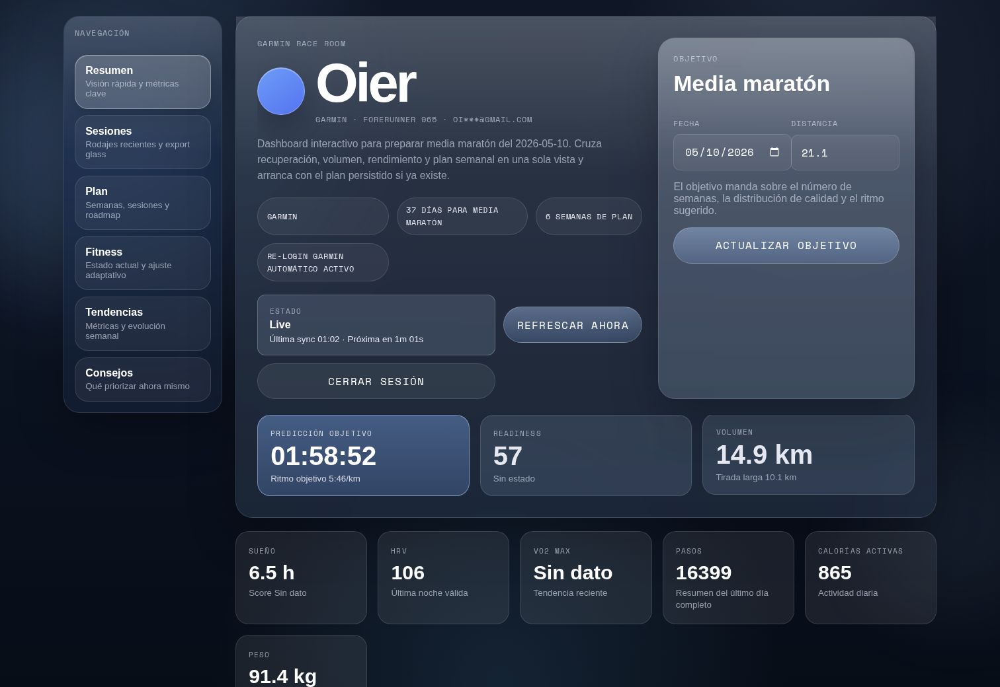
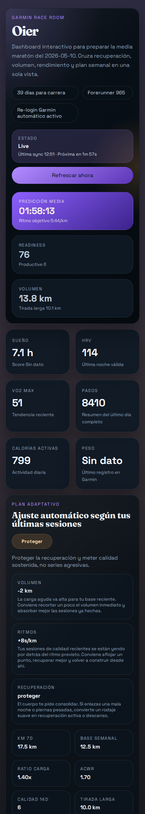

# Race Room

Dashboard responsive para Garmin Connect y Strava con login desde la propia app, plan adaptativo, export glass de entrenos y vista pensada para desktop y móvil. En la rama `feature/llm_gemma_4` añade además un coach basado en Gemma 4, check-in diario y sync más conservador.

## Vista rápida

<p align="center">
  
</p>

<p align="center">
  
</p>

## Qué incluye

- Wrapper local del servidor MCP de [`Nicolasvegam/garmin-connect-mcp`](https://github.com/Nicolasvegam/garmin-connect-mcp) en [`vendor/garmin-connect-mcp`](vendor/garmin-connect-mcp)
- Integración principal con [`python-garminconnect`](https://github.com/cyberjunky/python-garminconnect) mediante un bridge Python local
- Backend Express que consulta Garmin a través del MCP o Python API y Strava vía OAuth + REST API
- Frontend React + Recharts con sidebar de secciones, glass UI, motion ligero y objetivo editable
- Refresco automático más conservador: snapshot persistido al entrar, polling ligero en frontend y refresh del proveedor cada hora por defecto
- Reautenticación automática cuando caducan los tokens mientras existan credenciales activas en la sesión del usuario
- Plan dinámico según fecha objetivo, distancia y rendimiento reciente
- Coach adaptativo con Gemma 4 opcional, salida JSON validada y guardrails deterministas
- Check-in diario de 3 señales subjetivas para afinar textos y microajustes del plan
- Envío de entrenamientos futuros del plan a Garmin desde la propia app
- Export `PNG` glass sin fondo para compartir entrenos sobre una foto propia
- Persistencia ligera en SQLite del objetivo y del último dashboard/plan por usuario
- Modo degradado si Garmin devuelve rate limit o bloquea la autenticación
- Frontend preparado para desplegarse en GitHub Pages con `VITE_API_BASE_URL`

## Configuración

Crea un `.env` en la raíz del proyecto.

Mínimo para local:

```env
PORT=8787
FRONTEND_ORIGIN=http://localhost:5173
FRONTEND_APP_URL=http://localhost:5173/
```

Para Strava añade además:

```env
STRAVA_CLIENT_ID=tu_client_id
STRAVA_CLIENT_SECRET=tu_client_secret
STRAVA_REDIRECT_URI=http://localhost:8787/api/session/strava/callback
```

Para activar Gemma 4 en local con Ollama:

```bash
ollama pull gemma4:e2b
```

Y añade además:

```env
LLM_PROVIDER=ollama
LLM_BASE_URL=http://127.0.0.1:11434
LLM_MODEL=gemma4:e2b
LLM_MIN_INTERVAL_MINUTES=360

DASHBOARD_BACKGROUND_REFRESH_MINUTES=60
DASHBOARD_CACHE_TTL_MINUTES=20
DASHBOARD_FALLBACK_CACHE_TTL_MINUTES=5
```

Notas:

- Garmin no necesita dejar email y password fijos en `.env` para usar la app. Se introducen en el login y viven solo en la sesión activa.
- Si quieres usar el bridge Python de Garmin, instala antes el entorno con `npm run garmin:python:install`.
- Si quieres forzar el consumidor OAuth de `garth`, la API respeta `GARTH_OAUTH_KEY` y `GARTH_OAUTH_SECRET`.
- Si no configuras Gemma 4, Race Room sigue funcionando con el motor determinista base.

## Arranque local

1. Ejecuta `npm run garmin:python:install` si todavía no existe `.venv-garmin`.
2. Ejecuta `npm run dev`.
3. Espera a que la API anuncie `Garmin + Strava dashboard disponible en http://localhost:8787`.
4. Abre la URL que muestre Vite. En local normal suele ser `http://localhost:5173`, aunque puede subir a otro puerto si ya está ocupado.
5. Haz login desde la propia app con Garmin o Strava.
6. Ajusta el objetivo con fecha y distancia; la app persistirá ese objetivo y el último plan en `data/garmin-connect.sqlite`.
7. Si Gemma 4 está activo, completa el check-in diario para afinar el resumen fitness, el resumen del plan y los microajustes semanales.

## Arranque en móvil

Si quieres abrir la app desde el móvil dentro de la misma red local, usa el modo LAN:

1. Ejecuta `npm run dev:mobile`.
2. Saca la IP local del portátil con `hostname -I`.
3. Abre desde el móvil `http://TU_IP:5173`.

Ejemplo real de hotspot móvil:

- Si el teléfono comparte red y el portátil recibe una IP como `172.20.10.6`, abre `http://172.20.10.6:5173`.
- Este flujo es especialmente útil para Garmin.
- Para Strava, si quieres completar OAuth desde el móvil, necesitarás además que `STRAVA_REDIRECT_URI` apunte a una URL accesible desde el teléfono; `localhost` no sirve fuera del propio portátil.

## Scripts útiles

- `npm run dev`: frontend + backend
- `npm run dev:mobile`: frontend expuesto en LAN + backend
- `npm run dev:web:mobile`: solo frontend en `0.0.0.0:5173`
- `npm run start:api`: solo API
- `npm run build`: typecheck + build del frontend
- `npm run garmin:python:install`: crea el entorno Python e instala `garminconnect`
- `npm run garmin:python:setup`: hace el primer login interactivo usando tus credenciales de `.env` y guarda tokens en `~/.garminconnect`
- `npm run mcp:garmin`: arranca el servidor MCP local
- `npm run mcp:garmin:setup`: setup interactivo del MCP para guardar tokens en `~/.garmin-mcp/`

## Notas

- El flujo principal en este proyecto es Codex + app local. No depende de Cursor.
- Cada sesión de usuario guarda sus tokens de Garmin en un directorio temporal aislado y sus credenciales viven solo en memoria del backend.
- Las sesiones de Strava guardan `access_token` y `refresh_token` solo en memoria del backend y refrescan OAuth automáticamente mientras la sesión siga viva.
- `python-garminconnect` sigue disponible como respaldo, como vía de escritura y como referencia de autenticación.
- El backend persiste por email el último objetivo y dashboard/plan en SQLite para servir primero esa versión y refrescar Garmin después.
- El backend refresca el proveedor activo cada 60 minutos por defecto y el frontend consulta la API local cada 10 minutos.
- Gemma 4 no se invoca en cada sync: el snapshot del coach se reutiliza y solo se vuelve a generar cuando cambian señales clave o cuando haces el check-in diario.
- Si faltan tokens o caducan, el backend intenta autenticarse de nuevo por sí solo con las credenciales activas de la sesión actual.
- El plan adapta ritmos, volumen y texto con señales como ACWR, readiness, sueño, tirada larga reciente, cumplimiento, calidad de los últimos 14 días y percepción subjetiva del día.
- Los entrenamientos que no sean descanso, fuerza o carrera se pueden subir a Garmin para días futuros desde el panel semanal. En Strava el plan es de lectura y ajuste; no hay push de workouts.
- Si Garmin devuelve `429` o `427`, el dashboard entra en modo degradado y te deja refrescar más tarde sin romper la UI.
- GitHub Pages solo sirve el frontend. Para producción necesitas desplegar también la API en otro host y definir `FRONTEND_ORIGIN` en el backend y `VITE_API_BASE_URL` en el build del frontend.
- No voy a persistir tokens OAuth de usuarios en el repositorio ni en GitHub Pages. Eso no es seguro y Pages no puede ejecutar el backend que necesita el login de Garmin. La opción mantenible es: frontend en Pages y API+SQLite en un host pequeño aparte.
- El workflow de Pages está en `.github/workflows/deploy-pages.yml` y usa `VITE_APP_BASE=/garmin-interactive/`. Configura `VITE_API_BASE_URL` como variable del repositorio en GitHub.
